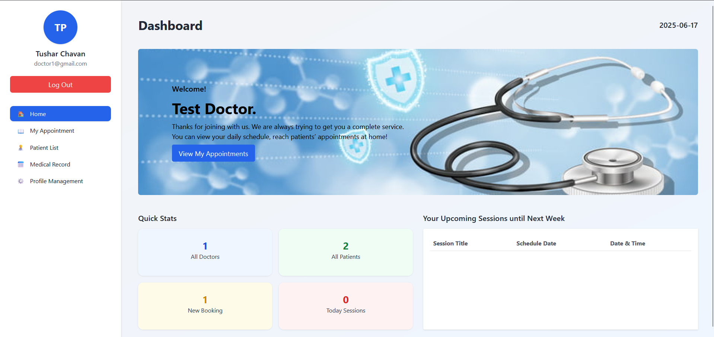
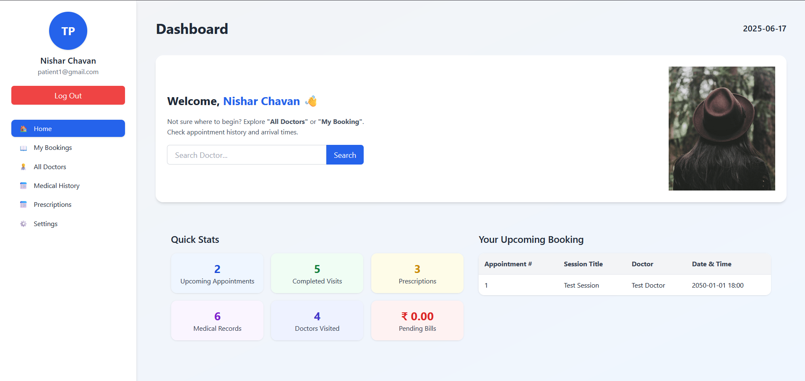

# 🏥 Hospital Management System

A web-based Hospital Management System built with **Flask**, **SQLite3**, **Tailwind CSS**, and **JavaScript** to help manage hospital workflows including appointments, patients, medical records, and prescriptions.

---

## 📌 Features

### 🔐 Authentication
- Role-based login system (Doctor, Patient)

### 🩺 Doctor Dashboard
- View patient list
- Manage appointments
- Add/view medical records
- Write/view prescriptions
- Manage profile

### 👨‍⚕️ Patient Dashboard
- Book appointments
- View medical history and prescriptions
- Browse doctors
- Update profile and settings

---

## 📁 Project Structure
#### Hospital-Management-System/
- │
- ├── app.py # Main Flask app
- ├── database.py # DB connection logic
- ├── patient.py # Patient DB logic
- ├── prescription.py # Prescription DB logic
- ├── *.db # SQLite database files
- │
- ├── templates/ # HTML templates
- │ ├── Login/
- │ ├── Doctor/
- │ └── Patient/
- │
- ├── static/ # Static files
- │ ├── styles.css
- │ ├── script.js
- │ └── images/
- │
- ├── requirements.txt # Python dependencies


---

## ⚙️ How to Run Locally

### 1. Clone the Repository
```bash
git clone https://github.com/2004Nishar/Hospital_Management_System.git
cd hospital-management-system
```
```bash
python -m venv venv
source venv/bin/activate   # Windows: venv\Scripts\activate
```
```bash
pip install -r requirements.txt
```
```bash
python app.py
```
```bash
http://127.0.0.1:5000
```
---
## 📸 Screenshots
### 👨‍⚕️ Doctor Dashboard


### 🧑‍⚕️ Patient Dashboard


---

## 📦 Requirements
```bash
Flask==2.3.3
gunicorn==21.2.0
```
- SQLite3 is part of the Python Standard Library, so you don’t need to install it separately.
---
## 🚧 Upcoming Features

We plan to expand the Hospital Management System with the following features:

- 🧾 **Billing & Invoices**  
  Automatically generate bills for appointments, treatments, and prescriptions.

- 📅 **Advanced Appointment Scheduling**  
  Enable patients to view available time slots and schedule/reschedule appointments in real time.

- 📊 **Admin Dashboard**  
  Add an admin panel to manage doctors, patients, appointments, and system analytics.

- 💬 **Chat System**  
  Implement a secure messaging system between patients and doctors for better communication.

- 🧠 **AI-Based Symptom Checker**  
  Integrate an AI-powered tool to help patients get basic advice before consulting a doctor.

- 📁 **Upload Medical Reports**  
  Allow doctors and patients to upload and access medical documents securely.

- 🔔 **Email/SMS Notifications**  
  Send alerts for upcoming appointments, prescription refills, and system updates.

  **Stay tuned for regular updates and improvements! 😊**
---
## 🙋‍♂️ Author
***Nishar Chavan***
📫 **Reach out to collaborate or connect:**
- 💼 LinkedIn: [LinkedIn](www.linkedin.com/in/nishar-chavan)
- 💌 Email: chavannishar04@gmail.com 
---
